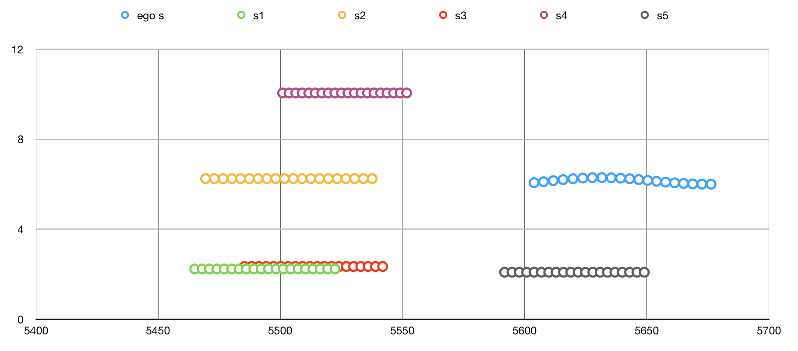
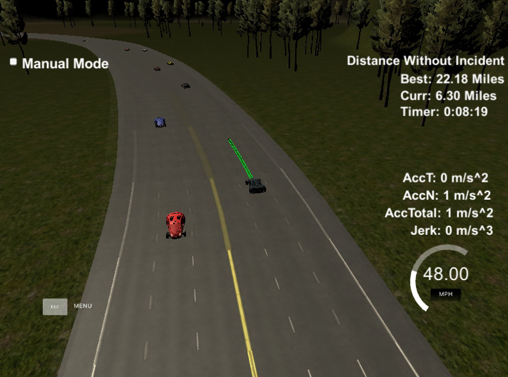

# Udacity Self-Driving Car Engineer Nanodegree
# Path Planning Project

## Introduction

The goal of this project is to navigate a car around a simulated highway scenario, including traffic and given waypoint, telemetry, and sensor fusion data. The car must not violate a set of motion constraints, namely maximum velocity, maximum acceleration, and maximum jerk, while also avoiding collisions with other vehicles, keeping to within a highway lane (aside from short periods of time while changing lanes), and changing lanes when doing so is necessary to maintain a speed near the posted speed limit.

This implementation is summarized in the following five steps:
1. Construct interpolated waypoints of nearby area
2. Determine ego car parameters and construct vehicle object
3. Generate predictions from sensor fusion data
4. Determine best trajectory
5. Produce new path

## Implementation

### 1. Construct Interpolated Waypoints of Nearby Area 

The track waypoints given in the `highway_map.csv` file are spaced roughly 30 meters apart, so the first step in the process is to interpolate a set of nearby map waypoints (in the current implementation, five waypoints ahead of and five waypoints behind the ego vehicle are used) and produce a set of much more tightly spaced (0.5 meters apart) waypoints which help to produce more accurate results from the `getXY` and `getFrenet` methods and also account for the discontinuity in `s` values at the end/beginning of the track.

### 2. Determine Ego Car Parameters and Construct Vehicle Object

The simulator returns instantaneous telemetry data for the ego vehicle, but it also returns the list of points from previously generated path. This is used to project the car's state into the future and a "planning state" is determined based on the difference between points at some prescribed number of points along the previous path. In effect, this can help to generate smoother transitions, handle latency from transmission between the controller and the simulator, and alleviate the trajectory generator of some computation overhead. 

The vehicle state and its associated (self-explanatory) methods are contained in the `Vehicle` class. These methods include `update_available_states` (i.e. "keep lane", "lane change left", "lane change right"), `get_target_for_state`, `generate_trajectory_for_target`, `get_leading_vehicle_data_for_lane`, and `generate_predictions` (for sensor fusion data).

### 3. Generate Predictions from Sensor Fusion Data

The sensor fusion data received from the simulator in each iteration is parsed and trajectories for each of the other cars on the road are generated. These trajectories match the duration and interval of the ego car's trajectories generated for each available state and are used in conjunction with a set of cost functions to determine a best trajectory for the ego car. A sample of these predicted trajectories (along with the ego car's predicted trajectory) is shown below.



### 4. Determine Best Trajectory

Using the ego car "planning state", sensor fusion predictions, and Vehicle class methods mentioned above, an optimal trajectory is produced. 

1. Available states are updated based on the ego car's current position, with some extra assistance from immediate sensor fusion data (I think of this similar to ADAS, helping to, for example, prevent "lane change left" as an available state if there is a car immediately to the left). 
2. Each available state is given a target Frenet state (position, velocity, and acceleration in both s and d dimensions) based on the current state and the traffic predictions. 
3. A quintic polynomial, jerk-minimizing (JMT) trajectory is produced for each available state and target (*note: although this trajectory was used for the final path plan in a previous approach, in the current implementation the JMT trajectory is only a rough estimate of the final trajectory based on the target state and using the `spline.h` library).
4. Each trajectory is evaluated according to a set of cost functions, and the trajectory with the lowest cost is selected. In the current implementation, these cost functions include:
  - Collision cost: penalizes a trajectory that collides with any predicted traffic trajectories.
  - Buffer cost: penalizes a trajectory that comes within a certain distance of another traffic vehicle trajectory.
  - In-lane buffer cost: penalizes driving in lanes with relatively nearby traffic.
  - Efficiency cost: penalizes trajectories with lower target velocity.
  - Not-middle-lane cost: penalizes driving in any lane other than the center in an effort to maximize available state options.

### 5. Produce New Path

The new path starts with a certain number of points from the previous path, which is received from the simulator at each iteration. From there a spline is generated beginning with the last two points of the previous path that have been kept (or the current position, heading, and velocity if no current path exists), and ending with two points 30 and 60 meters ahead and in the target lane. This produces a smooth x and y trajectory. To prevent excessive acceleration and jerk, the velocity is only allowed increment or decrement by a small amount, and the corresponding next x and y points are calculated along the x and y splines created earlier. 

## Conclusion

The resulting path planner works well, but not perfectly. It has managed to accumulate incident-free runs of over ten miles multiple times, and once navigating the track incident-free for over twenty miles (for which the image below is evidence). Improving the planner from this point is difficult due to the infrequency of infractions and inability to duplicate the circumstances that led up to an infraction. Overall, I am very satisfied with its performance.



*the description below is Udacity's original README for the project repo*

---

# CarND-Path-Planning-Project
Self-Driving Car Engineer Nanodegree Program
   
### Simulator. You can download the Term3 Simulator BETA which contains the Path Planning Project from the [releases tab](https://github.com/udacity/self-driving-car-sim/releases).

In this project your goal is to safely navigate around a virtual highway with other traffic that is driving +-10 MPH of the 50 MPH speed limit. You will be provided the car's localization and sensor fusion data, there is also a sparse map list of waypoints around the highway. The car should try to go as close as possible to the 50 MPH speed limit, which means passing slower traffic when possible, note that other cars will try to change lanes too. The car should avoid hitting other cars at all cost as well as driving inside of the marked road lanes at all times, unless going from one lane to another. The car should be able to make one complete loop around the 6946m highway. Since the car is trying to go 50 MPH, it should take a little over 5 minutes to complete 1 loop. Also the car should not experience total acceleration over 10 m/s^2 and jerk that is greater than 50 m/s^3.

#### The map of the highway is in data/highway_map.txt
Each waypoint in the list contains  [x,y,s,dx,dy] values. x and y are the waypoint's map coordinate position, the s value is the distance along the road to get to that waypoint in meters, the dx and dy values define the unit normal vector pointing outward of the highway loop.

The highway's waypoints loop around so the frenet s value, distance along the road, goes from 0 to 6945.554.

## Basic Build Instructions

1. Clone this repo.
2. Make a build directory: `mkdir build && cd build`
3. Compile: `cmake .. && make`
4. Run it: `./path_planning`.

Here is the data provided from the Simulator to the C++ Program

#### Main car's localization Data (No Noise)

["x"] The car's x position in map coordinates

["y"] The car's y position in map coordinates

["s"] The car's s position in frenet coordinates

["d"] The car's d position in frenet coordinates

["yaw"] The car's yaw angle in the map

["speed"] The car's speed in MPH

#### Previous path data given to the Planner

//Note: Return the previous list but with processed points removed, can be a nice tool to show how far along
the path has processed since last time. 

["previous_path_x"] The previous list of x points previously given to the simulator

["previous_path_y"] The previous list of y points previously given to the simulator

#### Previous path's end s and d values 

["end_path_s"] The previous list's last point's frenet s value

["end_path_d"] The previous list's last point's frenet d value

#### Sensor Fusion Data, a list of all other car's attributes on the same side of the road. (No Noise)

["sensor_fusion"] A 2d vector of cars and then that car's [car's unique ID, car's x position in map coordinates, car's y position in map coordinates, car's x velocity in m/s, car's y velocity in m/s, car's s position in frenet coordinates, car's d position in frenet coordinates. 

## Details

1. The car uses a perfect controller and will visit every (x,y) point it recieves in the list every .02 seconds. The units for the (x,y) points are in meters and the spacing of the points determines the speed of the car. The vector going from a point to the next point in the list dictates the angle of the car. Acceleration both in the tangential and normal directions is measured along with the jerk, the rate of change of total Acceleration. The (x,y) point paths that the planner recieves should not have a total acceleration that goes over 10 m/s^2, also the jerk should not go over 50 m/s^3. (NOTE: As this is BETA, these requirements might change. Also currently jerk is over a .02 second interval, it would probably be better to average total acceleration over 1 second and measure jerk from that.

2. There will be some latency between the simulator running and the path planner returning a path, with optimized code usually its not very long maybe just 1-3 time steps. During this delay the simulator will continue using points that it was last given, because of this its a good idea to store the last points you have used so you can have a smooth transition. previous_path_x, and previous_path_y can be helpful for this transition since they show the last points given to the simulator controller with the processed points already removed. You would either return a path that extends this previous path or make sure to create a new path that has a smooth transition with this last path.

## Tips

A really helpful resource for doing this project and creating smooth trajectories was using http://kluge.in-chemnitz.de/opensource/spline/, the spline function is in a single hearder file is really easy to use.

---

## Dependencies

* cmake >= 3.5
 * All OSes: [click here for installation instructions](https://cmake.org/install/)
* make >= 4.1
  * Linux: make is installed by default on most Linux distros
  * Mac: [install Xcode command line tools to get make](https://developer.apple.com/xcode/features/)
  * Windows: [Click here for installation instructions](http://gnuwin32.sourceforge.net/packages/make.htm)
* gcc/g++ >= 5.4
  * Linux: gcc / g++ is installed by default on most Linux distros
  * Mac: same deal as make - [install Xcode command line tools]((https://developer.apple.com/xcode/features/)
  * Windows: recommend using [MinGW](http://www.mingw.org/)
* [uWebSockets](https://github.com/uWebSockets/uWebSockets)
  * Run either `install-mac.sh` or `install-ubuntu.sh`.
  * If you install from source, checkout to commit `e94b6e1`, i.e.
    ```
    git clone https://github.com/uWebSockets/uWebSockets 
    cd uWebSockets
    git checkout e94b6e1
    ```

## Editor Settings

We've purposefully kept editor configuration files out of this repo in order to
keep it as simple and environment agnostic as possible. However, we recommend
using the following settings:

* indent using spaces
* set tab width to 2 spaces (keeps the matrices in source code aligned)

## Code Style

Please (do your best to) stick to [Google's C++ style guide](https://google.github.io/styleguide/cppguide.html).

## Project Instructions and Rubric

Note: regardless of the changes you make, your project must be buildable using
cmake and make!


## Call for IDE Profiles Pull Requests

Help your fellow students!

We decided to create Makefiles with cmake to keep this project as platform
agnostic as possible. Similarly, we omitted IDE profiles in order to ensure
that students don't feel pressured to use one IDE or another.

However! I'd love to help people get up and running with their IDEs of choice.
If you've created a profile for an IDE that you think other students would
appreciate, we'd love to have you add the requisite profile files and
instructions to ide_profiles/. For example if you wanted to add a VS Code
profile, you'd add:

* /ide_profiles/vscode/.vscode
* /ide_profiles/vscode/README.md

The README should explain what the profile does, how to take advantage of it,
and how to install it.

Frankly, I've never been involved in a project with multiple IDE profiles
before. I believe the best way to handle this would be to keep them out of the
repo root to avoid clutter. My expectation is that most profiles will include
instructions to copy files to a new location to get picked up by the IDE, but
that's just a guess.

One last note here: regardless of the IDE used, every submitted project must
still be compilable with cmake and make./
